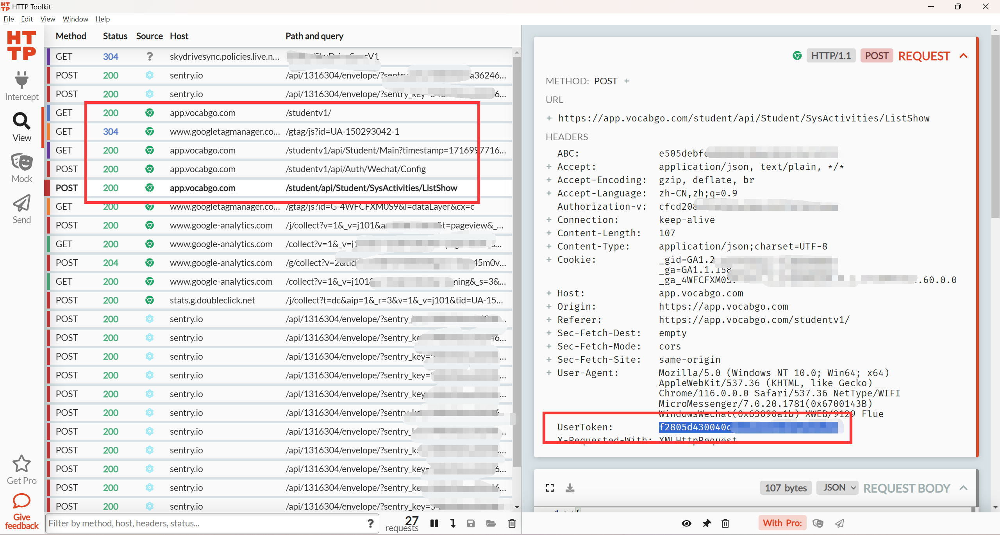
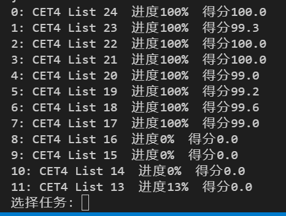

# 词达人-自动刷练习

### 因微信浏览器限制, 本软件需要自行抓包获取 `UserToken`, 并填入脚本文件

## 功能

✅ 刷班级任务  
✅ 时长合理 (一题10s, 一次练习约30分钟, *注意: 是上报的学习时长, 不是脚本运行时间*)  
✅ 高正确率 (>99%, 剩下1%暂不清楚是什么bug)  
❌ 除班级任务之外, 暂未适配  
❌ 不确定是否会封号, 建议不要短时间内大批量刷题  
❌ 不保证可以长久使用, 失效请踢我更新  

## 准备工作

- 下载程序本体 [main.py](./main.py), 仅此一个文件, 其他都不需要下载
- 下载一个 `HTTP抓包软件`, 如 [Fiddler (需付费)](http://www.fiddler2.com/fiddler2/), [HTTP Toolkit (半免费)](http://httptoolkit.com/)
- 安装抓包软件的 `根证书`, 使抓包软件可以截获 `HTTPS` 流量
  - 对于 `Fiddler 4` , 点击 `Tools`→`Options`→`HTTPS` 设置面板可以安装根证书
  - 对于 `HTTP Toolkit`, 需在主页选择 `Anything`, 然后导出证书, 并双击打开, 安装到 `受信任的根证书颁发机构`
- 配置系统代理为抓包软件的代理, 比如 `127.0.0.1:8001`, 具体端口因软件而异
- 至此, 你已完成抓包软件的配置

## 使用

1. 在微信打开词达人, 然后在抓包软件查看任意一条 `vocabgo.com` 相关请求, 如图, 在请求头部找到 `UserToken`, 并复制出来  

2. 使用编辑器打开 `main.py`, 在 `USER_TOKEN` 处填入抓包出来的 `UserToken`  

3. 运行 `main.py`, 将会出现班级任务列表, 填任务序号即可开刷  

## 原理

- 在进入练习, 获取到一份题目之后, 里面会包含 `topic_code (1)`
- 答题时, 会将 `topic_code (1)` 连同所选答案一起上传, 服务器批阅后返回 `topic_code (2)`
- 然后客户端会发送一个保存进度的请求, 里面包含 `topic_code (2)`, 服务器会根据 `topic_code (2)` 回溯答题情况, 并进行计分

**本程序利用如下特性自动刷题:**
- 使用 `topic_code (1)` 进行第一次作答 (填一个空白答案), 获得 `topic_code (2)`
- 再使用 `topic_code (2)` 再进行一次错误作答, 就能获得正确答案 (学生做题只有两次机会, 两次之后就能出答案)
  - 正常情况下, 客户端这时会自动使用 `topic_code (2)` 发送保存进度请求, 此时错误作答将被记录
  - 但本程序不会上传该错误作答, 而是用回 `topic_code (1)`, 结合刚刚获得的正确答案上传, 获得 `topic_code (3)`
- 由于 `topic_code (3)` 是正确作答产生的, 因此用 `topic_code (3)` 保存进度时, 服务器就会回溯到正确作答

*注意: `topic_code` 后面的序号是为了解释时便于辨识加上的, 实际上并不存在*

## 其他

词汇练习的响应报文中, `data` 字段的内容为 `base64` 编码, 但前面一小部分存在无法解码的内容, 这里的处理方法是寻找第一个 `ey` (即 JSON 中的 `{`) 再开始解码

部分抓包的请求已放在 `/api` 文件夹内, 有需要的可自行研究, **数据已进行脱敏处理**
